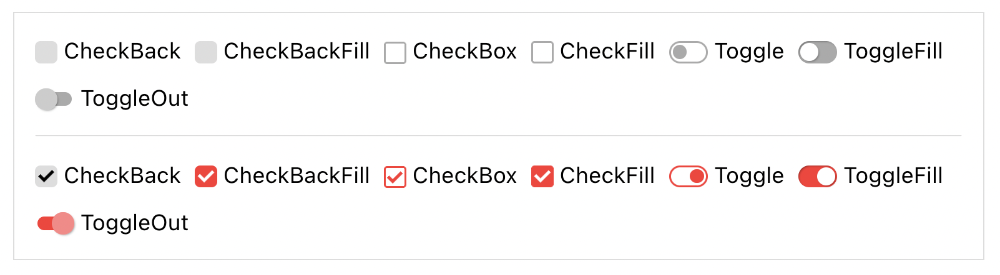

# Basik

> Basik is definitely not ready for production and I don't know if/when it will be, so far it's just a small experiment.

A component library for React that looks great out of the box. It has many component variations and can be easily styled further:



```js
import CheckBox from 'basik/CheckBox';
import CheckFill from 'basik/CheckFill';
import CheckBack from 'basik/CheckBack';
import CheckBackFill from 'basik/CheckBackFill';
import Toggle from 'basik/Toggle';
import ToggleFilled from 'basik/ToggleFilled';
import ToggleOut from 'basik/ToggleOut';

export default function App() {
  return (
    <div>
      <CheckBox />
      <CheckFill />
      <CheckBack />
      <CheckBackFill />
      <Toggle />
      <ToggleFilled />
      <ToggleOut />
    </div>
  );
}
```
